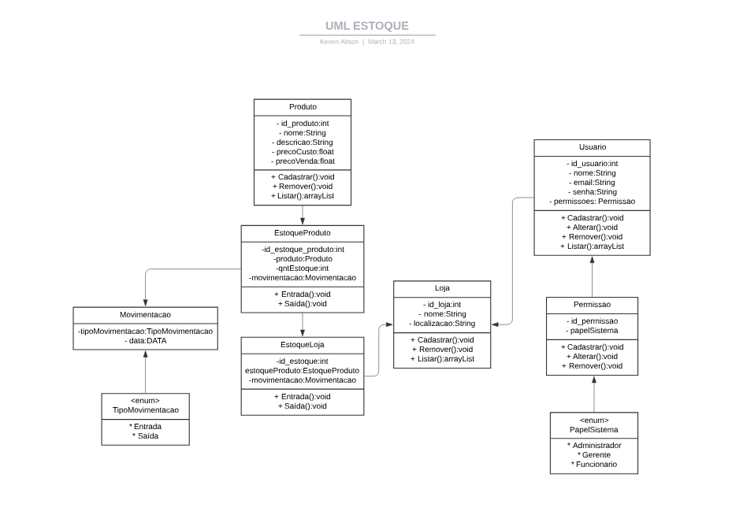

# Programação WEB II
## Atividade: Sistema de Controle de Estoque
## Keven Alison
Essa tarefa tem como objetivo iniciar a construção de um sistema de controle de estoque.   Para esta etapa será construído o "esqueleto" do projeto, definindo as principais classes e atributos.   

  
A partir desse UML, as classes foram construidas com base nas especificações da documentação da tarefa.  
Esta etapa refere-se apenas à parte da camada negocial da aplicação.
